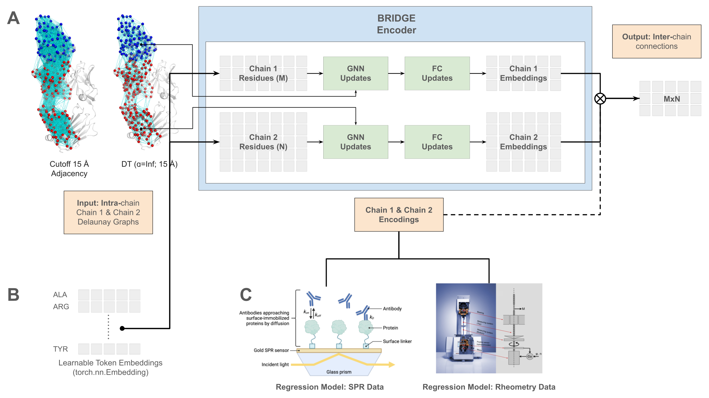

# <u>B</u>iophysical <u>R</u>epresentation of <u>I</u>nterfaces via <u>D</u>elaunay-based <u>G</u>raph <u>E</u>mbeddings (BRIDGE)



BRIDGE is a lightweight, cutting-edge **coarse-grained** molecular AI model designed for extracting **biophysically meaningful** embeddings from protein-protein interfaces by leveraging **Delaunay tessellation**.

## Prerequisites
All the requirements for training the BRIDGE encoder and applying it for Viscosity and/ Affinity prediction tasks through scripts can be found [here](requirements.txt).

## Building the BRIDGE 🌉

BRIDGE model can be trained using the `train.py` file. The following are the parameters for training. Also check [`config.yaml`](config.yaml) for the hyperparameters.
```
usage: train.py [-h] [--session SESSION] [--logger {tensorboard,wandb}] [--nodes NODES] [--lr LR] [--epochs EPOCHS] [--train_batchsize TRAIN_BATCHSIZE]
                [--valid_batchsize VALID_BATCHSIZE] [--test_batchsize TEST_BATCHSIZE] [--seed SEED]

options:
  -h, --help            show this help message and exit
  --session SESSION     Session directory (default: default)
  --logger {tensorboard,wandb}
                        Logger. (default: tensorboard)
  --nodes NODES
  --lr LR               Learning rate (default: 0.003)
  --epochs EPOCHS
  --train_batchsize TRAIN_BATCHSIZE
  --valid_batchsize VALID_BATCHSIZE
  --test_batchsize TEST_BATCHSIZE
  --seed SEED
```

Example command to train
```
python3 train.py --epochs 300 --lr 0.0001
```

## BRIDGE Encodings Application

BRIDGE Encodings can be used for many tasks related to proteins. However, we have applied it to Affinity and Viscosity of Antibodies in the manuscript. Please check the [`scripts/Affinity.py`](scripts/Affinity.py) and [`scripts/Viscosity.py`](scripts/Viscosity.py) files' `main` functions that list all the utilities with appropriate names such as:

* `create_vectorized_data_from_pdb()`: Generate and store embedding for user-specified files. 
 * `train()` & `test()`: Train & test the models for specific tasks respectively
* `BRIDGE_UMAP()`: Dimensionality reduction analysis of entire data un BRIDGE UMAP latest space.

Users are encouraged to look into `single_entry_process()` to create custom functions for their own data and tasks.

### Viscosity Leave One Out Cross Validation (LOOCV)
To run the viscosity analysis from the manuscript, please run the following command:
```
wandb sweep --project gnn_interface_viscosity_pred misc/viscosity_loo_sweep.yml
```
Follow the instructions given by `wandb` after running the command.

## Data
All the data used for the affinity & viscosity model is present in the `data` folder. Please give proper credit to the original authors if you use their data. Following is the list of datasets and links to the papers:
* [Sabdab Affinity](https://doi.org/10.1093/nar/gkt1043)
* [Pierce lab affinity subset](https://doi.org/10.1016/j.str.2021.01.005)
* [Viscosity Dataset](https://doi.org/10.1038/s41598-023-28841-4
)

## Results

All the images will be stored in [images](images/) folders after running different scripts.